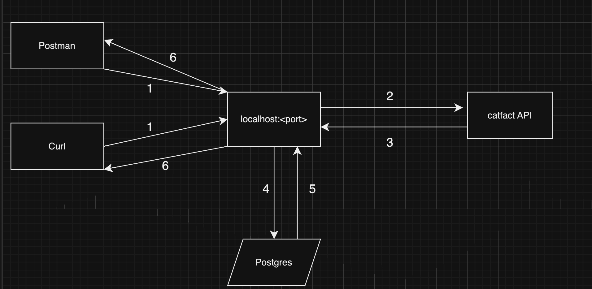

## Uy vazifa

- ### `cat-fact-service` nomli microservice yarating. Inchida `GET /cat-fact` degan endpoint yarating. Endpoint [cat-fact](https://catfact.ninja/fact) degan tashqi `API` ga so'rov yuboradi va natijasini `Postgres` da yangi jadvalga saqlaydi. 
- ### Jadvalga `id` qoyib clientga qaytarish kerak

